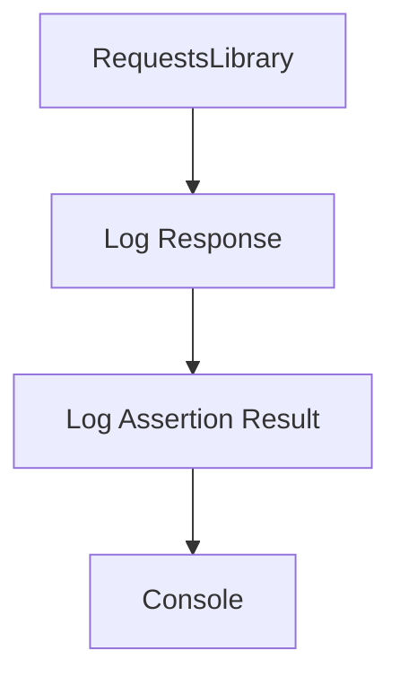

<div id="overview"></div>

## Choose how much to see

<div class="grid cards" markdown>

- **Summary**

    A compact view of every exchange.

- **Failures**

    Focus on the operations associated with recorded failures.

- **Full**

    Read protected headers and bodies with JSON highlighting.

</div>

```bash
poetry add robotframework-request-logger
```

!!! tip "Start simple"
    `mode=summary` is the default. Keep Robot's usual console;
    you do not need to change your execution command.

<section class="er-real-console" id="console-preview" tabindex="-1" markdown>

## The console, as generated

These images are Rich SVG exports from the project’s executable tests. The fictional book example returns HTTP 200 with an empty title; the test records a failing title assertion. Each tab shows the actual output.

=== "Summary"

    

=== "Failures"

    

=== "Full"

    

[See how to reproduce these outputs](console.md) · [Download the test case](assets/book-example.zip){ download }

</section>

Output is printed when the test ends. Buffering allows failure filtering and applies
known secrets across the entire test before any block is printed.

## Follow the exchange



[Explore JSON themes](themes.md){ data-preview }
