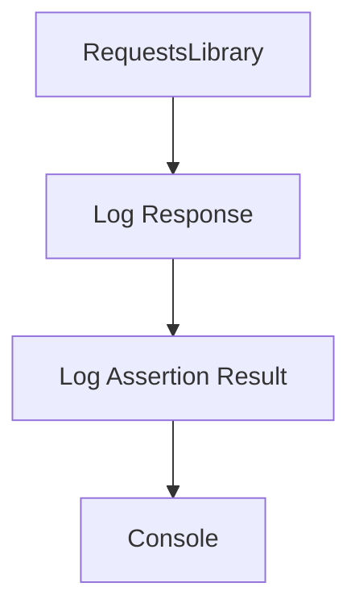

<div id="overview"></div>

## Choose how much to see

<div class="grid cards" markdown>

- **Summary**

    A compact view of every exchange.

- **Failures**

    Focus on the operations associated with recorded failures.

- **Full**

    Read protected headers and bodies with JSON highlighting.

</div>

```bash
poetry add robotframework-request-logger
```

!!! tip "Start simple"
    `mode=summary` is the default. Keep Robot's usual console;
    you do not need to change your execution command.


Output is printed when the test ends. Buffering allows failure filtering and applies
known secrets across the entire test before any block is printed.

## Follow the exchange



[Explore JSON themes](themes.md){ data-preview }
