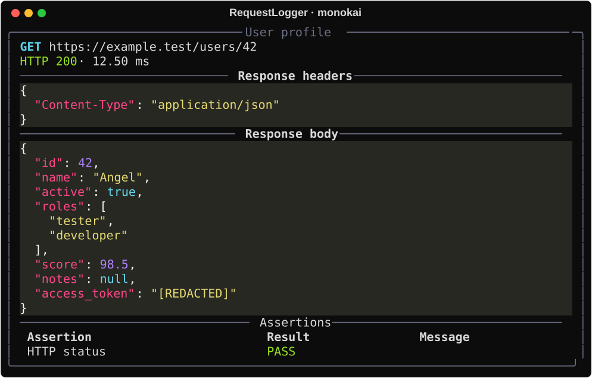

# Themes

Choose JSON syntax colors when importing the library. The default is `monokai`.
No configuration file is required. The theme supplies the JSON block background;
it does not change the terminal background, HTTP colors or assertion colors.
Text and empty responses do not receive JSON highlighting. Empty detail sections
are omitted. Borders and section separators use a soft neutral color.

All previews show the **same protected response**, exported from the production
Rich renderer at 90 columns. Terminal fonts and color capabilities may differ.
`ansi_dark` and `ansi_light` use your terminal palette; these exports use the
same dark terminal palette for comparison. Prefer `ansi_light` in a light terminal.

Available names depend on your installed Pygments version. An invalid name reports
the available choices. To list the names in your environment:

```bash
python -c "from request_logger.theme import available_themes; print(', '.join(available_themes()))"
```

## Theme previews

<div class="theme-gallery" data-theme-gallery
 data-copied="Copied" data-manual="Select the code to copy manually">
  <details class="theme-picker" hidden>
    <summary>Choose a theme: <strong data-theme-current>monokai</strong></summary>
    <div class="theme-picker-menu">
      <label for="theme-search">Search themes</label>
      <input id="theme-search" type="search" autocomplete="off" placeholder="one-dark, dracula…">
      <label for="theme-select">Available themes</label>
      <select id="theme-select" size="8"><option value="monokai">monokai</option><option value="abap">abap</option><option value="algol">algol</option><option value="algol_nu">algol_nu</option><option value="ansi_dark">ansi_dark</option><option value="ansi_light">ansi_light</option><option value="arduino">arduino</option><option value="autumn">autumn</option><option value="borland">borland</option><option value="bw">bw</option><option value="coffee">coffee</option><option value="colorful">colorful</option><option value="default">default</option><option value="dracula">dracula</option><option value="emacs">emacs</option><option value="friendly">friendly</option><option value="friendly_grayscale">friendly_grayscale</option><option value="fruity">fruity</option><option value="github-dark">github-dark</option><option value="gruvbox-dark">gruvbox-dark</option><option value="gruvbox-light">gruvbox-light</option><option value="igor">igor</option><option value="inkpot">inkpot</option><option value="lightbulb">lightbulb</option><option value="lilypond">lilypond</option><option value="lovelace">lovelace</option><option value="manni">manni</option><option value="material">material</option><option value="murphy">murphy</option><option value="native">native</option><option value="night-owl">night-owl</option><option value="nord">nord</option><option value="nord-darker">nord-darker</option><option value="one-dark">one-dark</option><option value="paraiso-dark">paraiso-dark</option><option value="paraiso-light">paraiso-light</option><option value="pastie">pastie</option><option value="perldoc">perldoc</option><option value="rainbow_dash">rainbow_dash</option><option value="rrt">rrt</option><option value="sas">sas</option><option value="solarized-dark">solarized-dark</option><option value="solarized-light">solarized-light</option><option value="staroffice">staroffice</option><option value="stata-dark">stata-dark</option><option value="stata-light">stata-light</option><option value="tango">tango</option><option value="trac">trac</option><option value="vim">vim</option><option value="vs">vs</option><option value="xcode">xcode</option><option value="zenburn">zenburn</option></select>
      <p data-theme-empty hidden role="status">No matching themes</p>
    </div>
  </details>
  <div class="theme-gallery-nav" hidden>
    <button type="button" data-theme-prev>Previous</button>
    <span data-theme-position role="status" aria-live="polite"></span>
    <button type="button" data-theme-next>Next</button>
  </div>
  <h3 data-theme-title>monokai</h3>
  
  <p data-theme-image-error hidden role="alert">Preview unavailable; open the image directly</p>
  <p><a data-theme-image-link href="../assets/themes/monokai.svg">monokai.svg</a></p>
  <div class="theme-gallery-code">
    <button type="button" data-theme-copy hidden>Copy import</button>
    <pre><code data-theme-import>*** Settings ***
Library    RequestLogger    mode=full    syntax_theme=monokai</code></pre>
    <span data-theme-copy-status role="status" aria-live="polite"></span>
  </div>
  <noscript><p>Available themes: <a href="../assets/themes/monokai.svg">monokai</a> · <a href="../assets/themes/abap.svg">abap</a> · <a href="../assets/themes/algol.svg">algol</a> · <a href="../assets/themes/algol_nu.svg">algol_nu</a> · <a href="../assets/themes/ansi_dark.svg">ansi_dark</a> · <a href="../assets/themes/ansi_light.svg">ansi_light</a> · <a href="../assets/themes/arduino.svg">arduino</a> · <a href="../assets/themes/autumn.svg">autumn</a> · <a href="../assets/themes/borland.svg">borland</a> · <a href="../assets/themes/bw.svg">bw</a> · <a href="../assets/themes/coffee.svg">coffee</a> · <a href="../assets/themes/colorful.svg">colorful</a> · <a href="../assets/themes/default.svg">default</a> · <a href="../assets/themes/dracula.svg">dracula</a> · <a href="../assets/themes/emacs.svg">emacs</a> · <a href="../assets/themes/friendly.svg">friendly</a> · <a href="../assets/themes/friendly_grayscale.svg">friendly_grayscale</a> · <a href="../assets/themes/fruity.svg">fruity</a> · <a href="../assets/themes/github-dark.svg">github-dark</a> · <a href="../assets/themes/gruvbox-dark.svg">gruvbox-dark</a> · <a href="../assets/themes/gruvbox-light.svg">gruvbox-light</a> · <a href="../assets/themes/igor.svg">igor</a> · <a href="../assets/themes/inkpot.svg">inkpot</a> · <a href="../assets/themes/lightbulb.svg">lightbulb</a> · <a href="../assets/themes/lilypond.svg">lilypond</a> · <a href="../assets/themes/lovelace.svg">lovelace</a> · <a href="../assets/themes/manni.svg">manni</a> · <a href="../assets/themes/material.svg">material</a> · <a href="../assets/themes/murphy.svg">murphy</a> · <a href="../assets/themes/native.svg">native</a> · <a href="../assets/themes/night-owl.svg">night-owl</a> · <a href="../assets/themes/nord.svg">nord</a> · <a href="../assets/themes/nord-darker.svg">nord-darker</a> · <a href="../assets/themes/one-dark.svg">one-dark</a> · <a href="../assets/themes/paraiso-dark.svg">paraiso-dark</a> · <a href="../assets/themes/paraiso-light.svg">paraiso-light</a> · <a href="../assets/themes/pastie.svg">pastie</a> · <a href="../assets/themes/perldoc.svg">perldoc</a> · <a href="../assets/themes/rainbow_dash.svg">rainbow_dash</a> · <a href="../assets/themes/rrt.svg">rrt</a> · <a href="../assets/themes/sas.svg">sas</a> · <a href="../assets/themes/solarized-dark.svg">solarized-dark</a> · <a href="../assets/themes/solarized-light.svg">solarized-light</a> · <a href="../assets/themes/staroffice.svg">staroffice</a> · <a href="../assets/themes/stata-dark.svg">stata-dark</a> · <a href="../assets/themes/stata-light.svg">stata-light</a> · <a href="../assets/themes/tango.svg">tango</a> · <a href="../assets/themes/trac.svg">trac</a> · <a href="../assets/themes/vim.svg">vim</a> · <a href="../assets/themes/vs.svg">vs</a> · <a href="../assets/themes/xcode.svg">xcode</a> · <a href="../assets/themes/zenburn.svg">zenburn</a></p></noscript>
</div>
