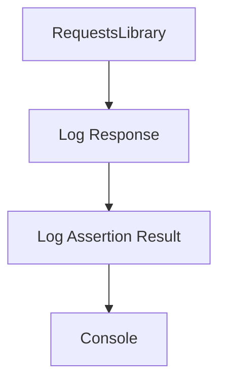

<div id="overview"></div>

## Elige cuánto quieres ver

<div class="grid cards" markdown>

- **Summary**

    Una vista compacta de cada intercambio.

- **Failures**

    Enfócate en operaciones asociadas con fallos registrados.

- **Full**

    Lee headers y cuerpos protegidos con resaltado JSON.

</div>

```bash
poetry add robotframework-request-logger
```

!!! tip "Empieza sencillo"
    `mode=summary` es el valor predeterminado. Conserva la consola habitual de Robot;
    no necesitas cambiar el comando de ejecución.

<section class="er-real-console" id="console-preview" markdown>

## La consola, tal como se genera

Estas imágenes son exportaciones SVG de Rich desde las pruebas ejecutables del proyecto. El ejemplo contiene un fallo intencional; muestra la salida real de cada modo.

=== "Summary"

    

=== "Failures"

    

=== "Full"

    

[Ver cómo reproducir estas salidas](console.md)

</section>

La impresión ocurre al cerrar el test. El buffering permite filtrar fallos y aplicar
secretos conocidos durante todo el caso antes de emitir cualquier bloque.

## Sigue el intercambio



[Explora los temas de JSON](themes.md){ data-preview }
